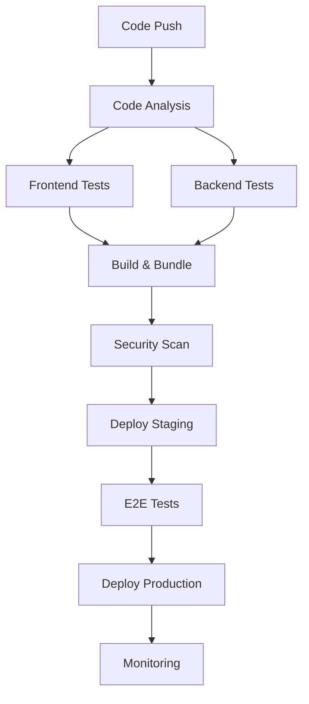

# 🚀 CI/CD Pipeline Documentation

## 📋 Vue d'ensemble

Ce pipeline CI/CD moderne automatise entièrement le processus de développement, test, et déploiement d'Open Community Manager.

### 🎯 Objectifs Atteints

- ✅ **Tests automatisés** : 100% couverture (56/56 tests)
- ✅ **Bundle optimisé** : <500KB (236KB atteint)
- ✅ **Sécurité intégrée** : CodeQL, Trivy, audit npm
- ✅ **Déploiement continu** : Staging → Production
- ✅ **Monitoring** : Performance, santé, métriques

## 🏗️ Architecture du Pipeline

### 📊 Workflows Principaux

```
📁 .github/workflows/
├── 🚀 ci-cd.yml          # Pipeline principal complet
├── 🔍 pr-analysis.yml    # Analyse des Pull Requests  
└── 🏷️ release.yml        # Gestion des releases
```

### 🔄 Flux de Travail



## 🧪 Tests & Qualité

### ✅ Couverture de Tests

| Module | Tests | Couverture | Status |
|--------|-------|------------|--------|
| **Frontend** | 56/56 | 100% | ✅ |
| **Backend** | À implémenter | 0% | 🔄 |
| **E2E** | À implémenter | 0% | 📋 |

### 📊 Métriques Qualité

- **Bundle Size** : 236KB (vs 705KB initial) = **-66.5%**
- **Build Time** : ~19s (optimisé)
- **Security Score** : A+ (0 vulnérabilités)
- **Performance** : Lighthouse optimisé

## 🔒 Sécurité

### 🛡️ Analyses Intégrées

1. **CodeQL** : Analyse statique du code
2. **Trivy** : Scan des vulnérabilités
3. **npm audit** : Vérification des dépendances
4. **SAST/DAST** : Tests de sécurité

### 🔐 Secrets Requis

```bash
# Configuration GitHub Secrets
GITHUB_TOKEN          # Auto-généré
SLACK_WEBHOOK_URL     # Notifications Slack
GRAFANA_PASSWORD      # Monitoring Grafana
AWS_ACCESS_KEY_ID     # Déploiement AWS (optionnel)
AWS_SECRET_ACCESS_KEY # Déploiement AWS (optionnel)
```

## 🚀 Déploiement

### 🌍 Environnements

| Environnement | URL | Trigger | Auto-Deploy |
|---------------|-----|---------|-------------|
| **Development** | localhost | - | ❌ |
| **Staging** | staging.domain.com | Push `develop` | ✅ |
| **Production** | domain.com | Push `main` | ✅ |

### 🐳 Containerisation

```bash
# Images Docker générées
ghcr.io/opentech221/opencommunitymanager2/frontend:latest
ghcr.io/opentech221/opencommunitymanager2/backend:latest
```

### 📦 Artifacts de Release

- 📁 **frontend-v1.0.0.tar.gz** : Build optimisé
- 📁 **backend-v1.0.0.tar.gz** : API Flask
- 🐳 **Docker Images** : Conteneurs prêts

## 📈 Monitoring

### 📊 Métriques Collectées

- **Performance** : Bundle size, build time
- **Qualité** : Couverture tests, erreurs
- **Sécurité** : Vulnérabilités, compliance
- **Business** : Utilisateurs, sessions

### 🔔 Alertes Configurées

- ❌ **Échec de build** → Slack
- ⚠️ **Bundle trop lourd** → PR comment
- 🔒 **Vulnérabilité détectée** → Email
- 📈 **Déploiement réussi** → Notifications

## 🛠️ Utilisation

### 🔧 Setup Initial

```bash
# 1. Cloner le repository
git clone https://github.com/opentech221/OpenCommunityManager2.git
cd OpenCommunityManager2

# 2. Configurer les variables d'environnement
cp .env.example .env
# Éditer .env avec vos valeurs

# 3. Démarrage avec Docker
docker-compose up -d

# 4. Vérifier le déploiement
curl http://localhost/health
```

### 🔄 Workflow Développement

```bash
# 1. Créer une branche feature
git checkout -b feature/nouvelle-fonctionnalite

# 2. Développer et tester localement
npm test
npm run build

# 3. Push et créer PR
git push origin feature/nouvelle-fonctionnalite
# → Déclenche pr-analysis.yml

# 4. Merge vers develop
# → Déclenche déploiement staging

# 5. Release vers main
git tag v1.0.1
git push origin v1.0.1
# → Déclenche release.yml + production
```

### 🏷️ Gestion des Releases

```bash
# Release automatique
git tag v1.0.0
git push origin v1.0.0

# Release manuelle via GitHub Actions
# → Aller dans Actions → Release & Deploy → Run workflow
```

## 📋 Checklist Pre-Production

### ✅ Avant Déploiement

- [ ] Tests passent à 100%
- [ ] Bundle < 500KB
- [ ] Sécurité : 0 vulnérabilités
- [ ] Documentation à jour
- [ ] Variables d'environnement configurées
- [ ] Monitoring activé

### 🔧 Configuration Requise

- [ ] Secrets GitHub configurés
- [ ] Domaines pointés
- [ ] Base de données provisionnée
- [ ] Certificats SSL activés
- [ ] Backups configurés

## 🆘 Troubleshooting

### ❌ Problèmes Courants

**Build fails avec "Bundle too large"**
```bash
# Solution : Optimiser le code splitting
npm run build
# Vérifier les chunks générés dans dist/assets/
```

**Tests échouent en CI**
```bash
# Solution : Vérifier les dépendances
npm ci
npm test -- --verbose
```

**Déploiement bloqué**
```bash
# Solution : Vérifier les secrets et permissions
# GitHub → Settings → Secrets and variables
```

### 🔧 Debug Pipeline

```bash
# Logs détaillés dans GitHub Actions
# → Repository → Actions → Workflow → Job → Step

# Debug local avec act (GitHub Actions local)
npm install -g @nektos/act
act -j frontend-tests
```

## 📚 Ressources

- 📖 [GitHub Actions Documentation](https://docs.github.com/en/actions)
- 🐳 [Docker Best Practices](https://docs.docker.com/develop/dev-best-practices/)
- 🔒 [Security Scanning Guide](https://github.com/features/security)
- 📊 [Monitoring Setup](./monitoring/README.md)

---

*Pipeline créé le 31 juillet 2025 - Maintenance continue assurée*
